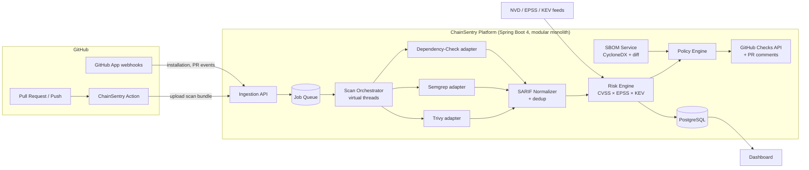

# ChainSentry

> **Supply-chain security, built into your CI.** ChainSentry scans your code, dependencies, and containers, then tells you which findings *actually matter* — ranked by real-world exploitability, not just CVSS labels.

[]()
[]()
[]()
[]()

---

## The problem

Post-Log4Shell and SolarWinds, every engineering org knows it needs supply-chain security. But the tools they get are noisy: a typical scan of a mid-size service produces **hundreds of findings**, of which fewer than 5% are ever exploited in the wild. Teams either drown in alerts or turn the scanner off.

## What makes ChainSentry different

Most scanner wrappers stop at "run Trivy, dump results." ChainSentry treats scanning as step one of five:

| Capability | What it means |
|---|---|
| 🎯 **Risk-based prioritization** | Every finding gets a composite risk score: CVSS base × **EPSS** exploit probability × **CISA KEV** (known-exploited) membership × dependency scope (direct vs transitive, runtime vs test). A "Critical" CVE in a test-only dependency ranks below a "High" that's in the KEV catalog. |
| 🔀 **PR supply-chain delta** | On every pull request, ChainSentry diffs the SBOM of the head branch against the base and comments: *"This PR adds 4 new transitive dependencies; 1 carries a critical, actively-exploited CVE."* Reviewers see the risk **they are about to merge**, not the whole backlog. |
| 📜 **Policy-as-code** | A `chainsentry.yml` in the repo defines the gate: fail on KEV, fail on critical with fix available, allow time-boxed suppressions with an owner and expiry date. Policies are versioned with the code they protect. |
| 🧾 **SBOM + OpenVEX** | Generates CycloneDX SBOMs on every build, and turns approved suppressions into **OpenVEX** statements — machine-readable "not affected, because…" documents that downstream consumers and auditors can verify. |
| 🤖 **AI-assisted remediation** | Claude-powered explanations of *why* a finding matters in this codebase, plus draft upgrade PRs for fixable dependency vulnerabilities. |
| 🧩 **Unified finding model** | Trivy, Semgrep, and OWASP Dependency-Check results are normalized to one SARIF-based model and de-duplicated across scanners, so one real vulnerability = one finding. |

## Architecture at a glance



Full details in [docs/02-ARCHITECTURE.md](docs/02-ARCHITECTURE.md).

## Tech stack

- **Java 24** (→ 25 LTS), virtual threads for scanner orchestration
- **Spring Boot 4.1** / Spring Framework 7, modular-monolith (Spring Modulith conventions)
- **PostgreSQL 16** + Flyway migrations, **Redis** for job queue & feed caching
- **Trivy · Semgrep · OWASP Dependency-Check** as containerized scanner engines
- **CycloneDX** SBOMs, **OpenVEX**, **SARIF** interchange
- **GitHub App** (webhooks, Checks API) + **GitHub Action** (composite, fails builds on policy breach)
- **Testcontainers** integration tests, GitHub Actions CI
- Full list & reasoning: [docs/03-TECH-STACK.md](docs/03-TECH-STACK.md)

## Repository layout

```
chainsentry/
├── backend/            Spring Boot platform (API, orchestrator, engines)
├── github-action/      Composite GitHub Action (scan + gate in CI)
├── docs/               Vision, architecture, data model, API, roadmap
├── docker-compose.yml  Local dev: Postgres, Redis
└── .github/workflows/  CI for this repo itself
```

## Quick start (development)

```bash
# 1. Infrastructure
docker compose up -d

# 2. Backend (needs JDK 24+, see docs/08-DEV-SETUP.md)
cd backend
mvn spring-boot:run
```

API comes up on `http://localhost:8080`, health at `/actuator/health`.

## Project status

🚧 **In active development.** See the [roadmap](docs/06-ROADMAP.md) for the phased plan (MVP → GitHub App → risk engine → dashboard → AI remediation).

## Docs

| Doc | Contents |
|---|---|
| [01-VISION.md](docs/01-VISION.md) | Problem, market, positioning, why this project matters |
| [02-ARCHITECTURE.md](docs/02-ARCHITECTURE.md) | Modules, flows, key design decisions |
| [03-TECH-STACK.md](docs/03-TECH-STACK.md) | Every technology choice + the reasoning |
| [04-DATA-MODEL.md](docs/04-DATA-MODEL.md) | Entities, ERD, scoring formula |
| [05-API-DESIGN.md](docs/05-API-DESIGN.md) | REST API surface |
| [06-ROADMAP.md](docs/06-ROADMAP.md) | Phased delivery plan with checklists |
| [07-GITHUB-APP-SETUP.md](docs/07-GITHUB-APP-SETUP.md) | Registering and wiring the GitHub App |
| [08-DEV-SETUP.md](docs/08-DEV-SETUP.md) | Local environment setup |
| [09-INTERVIEW-TALKING-POINTS.md](docs/09-INTERVIEW-TALKING-POINTS.md) | How to present this project |

## License

MIT
