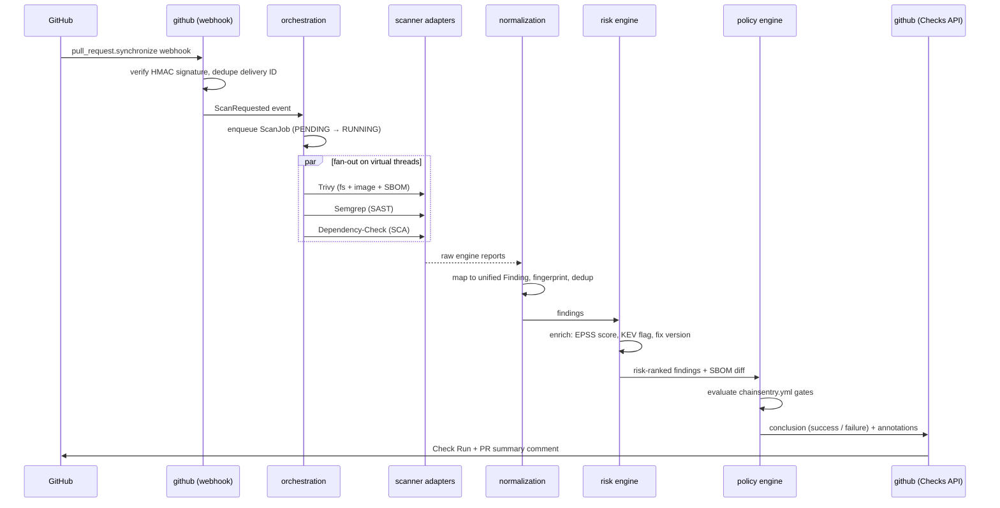

# Architecture

## Shape: modular monolith, extraction-ready

One Spring Boot 4 deployable, organized as **Spring Modulith-style modules** with enforced boundaries (each module exposes an API package; internals are package-private; modules communicate via application events or public service interfaces). This gives microservice-grade separation without the operational cost — and each module is a clean extraction seam if scale ever demands it.

```
backend/src/main/java/io/chainsentry/
├── ChainSentryApplication.java
├── github/          # GitHub App: webhook ingestion, Checks API, PR comments, installation tokens
├── orchestration/   # Scan lifecycle: jobs, queueing, scanner fan-out, retries, timeouts
├── scanner/         # Engine adapters: Trivy, Semgrep, Dependency-Check (each behind ScannerEngine SPI)
├── normalization/   # SARIF mapping, cross-scanner dedup, fingerprinting
├── risk/            # Risk engine: CVSS × EPSS × KEV × scope; feed sync (NVD/EPSS/KEV)
├── sbom/            # CycloneDX generation/storage, SBOM diff, OpenVEX emission
├── policy/          # chainsentry.yml parsing, gate evaluation, suppressions
├── remediation/     # AI explanations & fix-PR drafting (Claude API)   [phase 5]
├── dashboard/       # Read-model REST API for the UI
└── shared/          # Cross-cutting: ids, money-free value types, error model
```

## The core flow: a pull request gets scanned



## Key design decisions

### 1. Scanner engines run as containers, adapters stay thin
Each engine implements the `ScannerEngine` SPI (`supports()`, `scan(ScanContext) → RawReport`). The adapter launches the official engine image (`aquasec/trivy`, `semgrep/semgrep`, `owasp/dependency-check`) via the Docker API with the workspace mounted read-only, a hard timeout, and CPU/memory limits. Benefits:
- engine upgrades = image tag bump, no library lock-in
- engine crash can't take down the platform
- identical execution locally, in CI (the Action), and server-side

### 2. Virtual threads for orchestration
Scanner runs are long-blocking (seconds to minutes of process wait). One virtual thread per scanner run keeps the code sequential-and-readable while a single node comfortably drives hundreds of concurrent scans. `spring.threads.virtual.enabled=true` plus structured per-job scopes.

### 3. Queue: Redis Streams with a DB outbox
Webhook handler writes the job row + outbox event in one Postgres transaction (no lost scans), a relay publishes to Redis Streams, consumer groups give at-least-once delivery with claim-based retry. Idempotency key = `(repo, commit SHA, scanner set)` so redeliveries collapse.

### 4. Unified finding model over SARIF
All engine output maps into a SARIF-aligned internal model. Dedup fingerprint:
`hash(vulnId | normalized package coordinates | location)` — Trivy and Dependency-Check reporting the same CVE on the same artifact collapse into one Finding with two `sources`.

### 5. Risk score (the differentiator)
```
risk = W_cvss·(CVSS/10) + W_epss·EPSS + W_kev·KEV + W_scope·scope_factor
```
Defaults: `W_cvss=0.25, W_epss=0.40, W_kev=0.25, W_scope=0.10`; KEV∈{0,1}; scope_factor: direct-runtime 1.0, transitive-runtime 0.7, direct-test 0.3, transitive-test 0.15. Weights are org-configurable. Feeds: EPSS CSV (daily), CISA KEV JSON (daily), synced by a scheduled job into Postgres with Redis caching. Rationale: EPSS gets the largest weight because exploit *probability* is what CVSS lacks; KEV is a step function because "actively exploited" should dominate.

### 6. SBOM diff = the PR story
Trivy generates a CycloneDX SBOM per scan. Diffing head vs base component sets yields: added / removed / upgraded components, each annotated with its vulnerabilities. This powers the PR comment and is the feature demo to lead with.

### 7. GitHub App vs OAuth App
GitHub App: per-installation tokens (short-lived, least-privilege), Checks API access, org-level install. Permissions requested: `checks:write`, `contents:read`, `pull_requests:write`, `metadata:read`. Webhook HMAC verified on every delivery; JWT → installation token exchange cached until expiry.

### 8. Two execution modes, one policy engine
- **Server-side scan** (SaaS mode): platform clones and scans — needed for the dashboard/history.
- **CI-side scan** (Action mode): the GitHub Action runs engines in the runner and uploads the normalized bundle — code never leaves the customer's infra. **The policy gate evaluates identically in both modes.** This dual-mode story is a strong security-architecture talking point.

## Cross-cutting

- **Security of the platform itself:** webhook HMAC, encrypted-at-rest installation tokens, scanned-code workspaces are ephemeral tmpfs mounts, engines run non-root with no network (except DB downloads), rate limiting on public endpoints. The security tool must be visibly secure.
- **Observability:** Micrometer → Prometheus; traces via OpenTelemetry; per-engine scan duration/failure-rate metrics from day one.
- **Testing:** Testcontainers (Postgres, Redis, and *the actual scanner images*) for integration tests; golden-file tests for normalization (recorded engine JSON → expected Findings); ArchUnit/Modulith tests to enforce module boundaries.

## Deliberate trade-offs

| Decision | Alternative | Why this way |
|---|---|---|
| Modular monolith | Microservices | One-person project; boundaries enforced in-process; extraction later is cheap, premature distribution isn't |
| Redis Streams | Kafka / RabbitMQ | Already need Redis for caching; Streams gives consumer groups + persistence; Kafka is résumé-driven overkill here |
| Postgres JSONB for raw reports | S3/object store | Raw engine output is small (MBs); JSONB keeps queries simple; object store when volume demands |
| Docker-out-of-Docker engine execution | Embedding engine libs | Isolation, upgradability, honest SaaS architecture |
