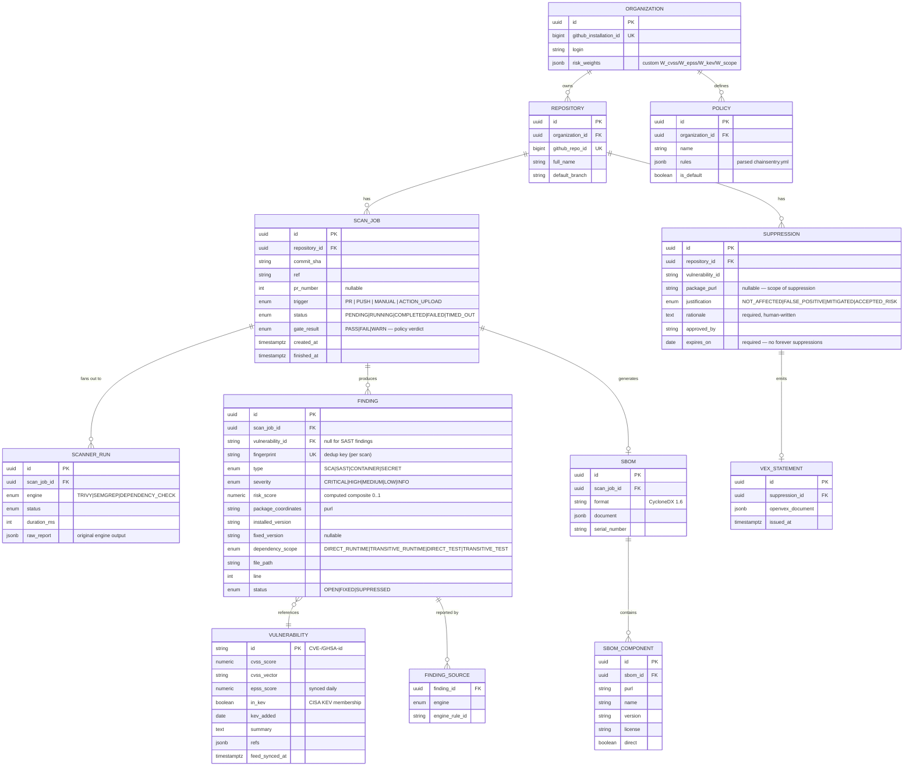

# Data Model

## ERD



## Design notes

- **`VULNERABILITY` is a shared reference table**, not per-finding data. EPSS/KEV sync updates it in place; risk scores are recomputed for open findings when feeds change (a CVE entering KEV overnight should re-rank existing findings — nice demo).
- **`fingerprint`** = SHA-256 of `(vuln id | purl | normalized path)` — dedups the same CVE reported by both Trivy and Dependency-Check within a scan; across scans it enables "first seen / still open" tracking.
- **`purl`** (package URL, e.g. `pkg:maven/org.apache.logging.log4j/log4j-core@2.14.1`) is the universal component key — the ecosystem standard worth name-dropping.
- **SBOM diff** is computed from `SBOM_COMPONENT` sets of two scans (base vs head), not stored — it's derived data.
- **Suppressions require an expiry and rationale** — this is a product opinion (no permanent silencing) and generates the OpenVEX statement.

## Risk score computation

```
risk = 0.25·(CVSS/10) + 0.40·EPSS + 0.25·KEV + 0.10·scope_factor
```

- Stored per finding (`risk_score`), recomputed on feed sync.
- Weights come from `ORGANIZATION.risk_weights` with these defaults.
- SAST findings (no CVE) fall back to severity-mapped base + Semgrep confidence.

## Policy file (`chainsentry.yml` in the scanned repo)

```yaml
version: 1
gate:
  fail_on:
    - kev: true                    # any KEV finding fails the build
    - severity: critical
      fix_available: true          # critical + upgradable = no excuse
    - risk_score: ">= 0.75"
  warn_on:
    - severity: high
ignore:
  paths: ["**/test/**", "docs/**"]
suppressions_file: .chainsentry/suppressions.yml
sbom:
  formats: [cyclonedx-json]
  attach_to_release: true
```
